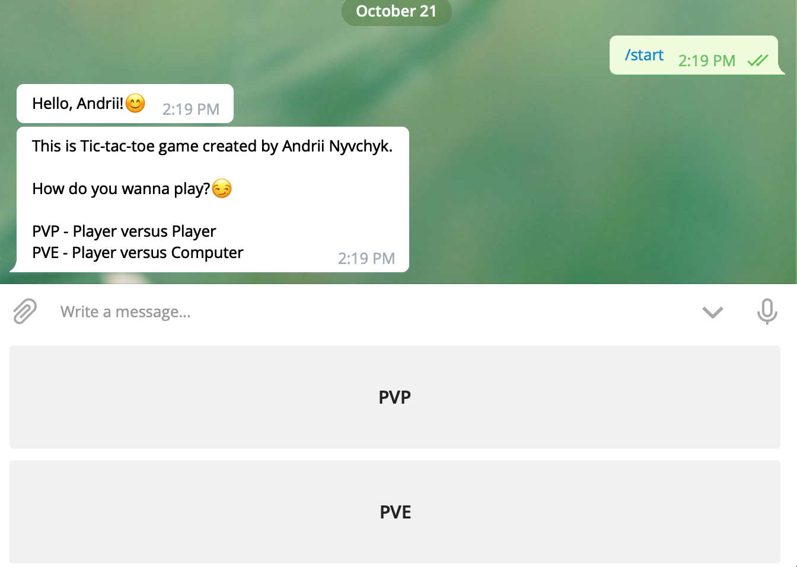
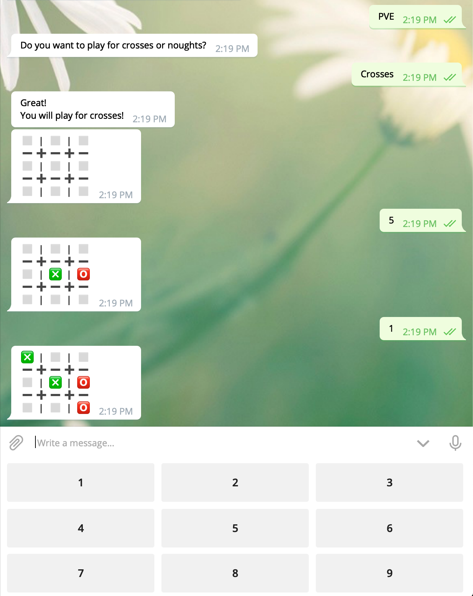

### What is "AndysTicTacToe"?

It is a Telegram bot for playing Tic-Tac-Toe game.

---

### How is it done?

It is written in Ruby with Andrii Nyvchyk's hands. And as a Telegram API I've used [this Ruby wrapper](https://github.com/atipugin/telegram-bot-ruby), which was created by [@atipugin](https://github.com/atipugin).

---

### Could I run this bot on my machine?

Yes, you could do it!

1. Install Ruby
1. Install Ruby wrapper for Telegram's Bot API here: https://github.com/atipugin/telegram-bot-ruby
1. Create a Bot using [Telegram's BotFather](https://t.me/botfather)
1. Clone this repository
1. Open in any editor file `src/main.rb` and replace `token` in qoutes with your token from [BotFather](https://t.me/botfather)
1. Move to `src` directory
1. Run `ruby main.rb`
1. ???
1. You are awesome! Now you have your own Tic-Tac-Toe game!

### Examples
* 
* 
* 
